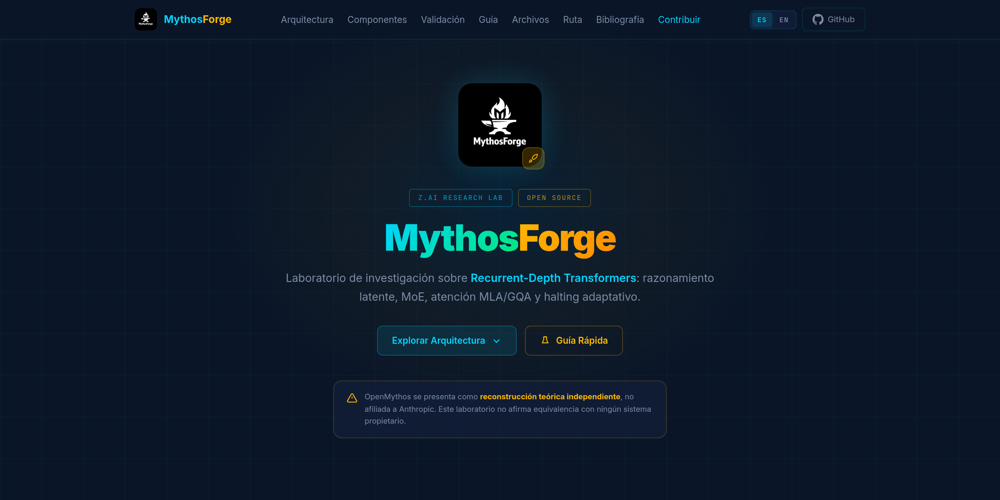
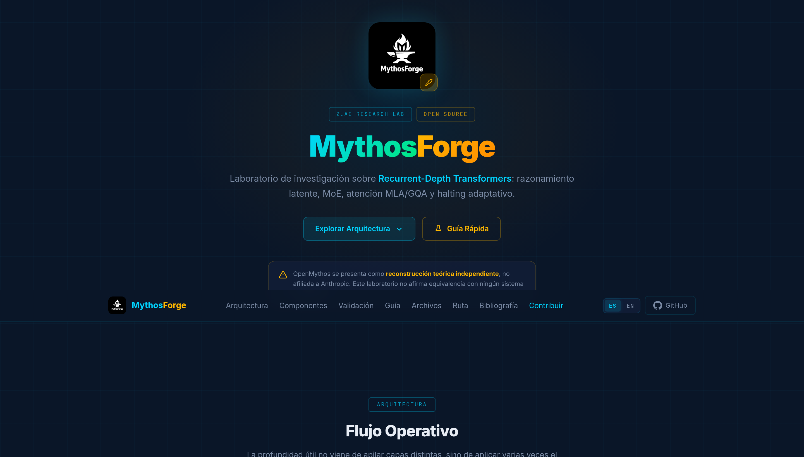
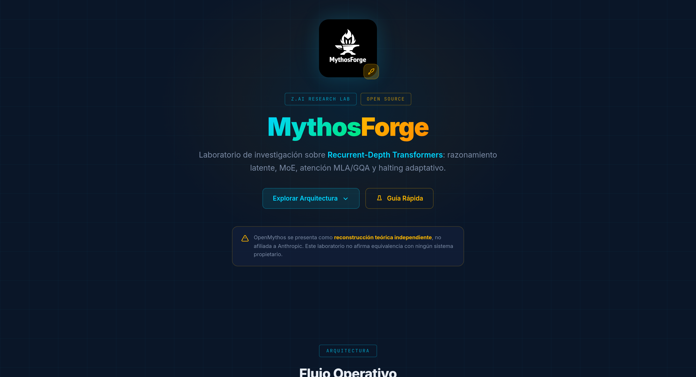
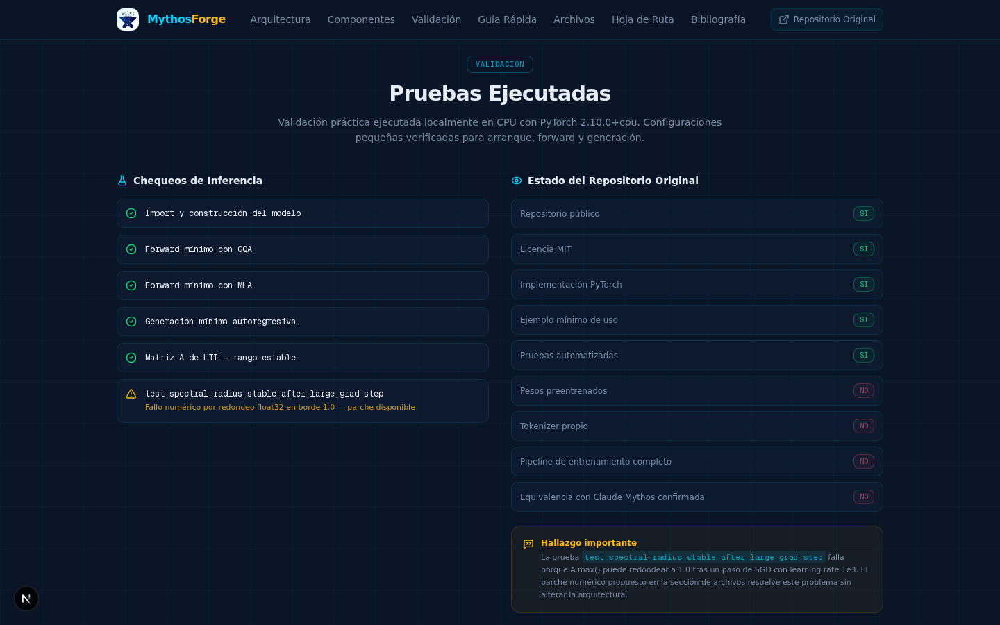
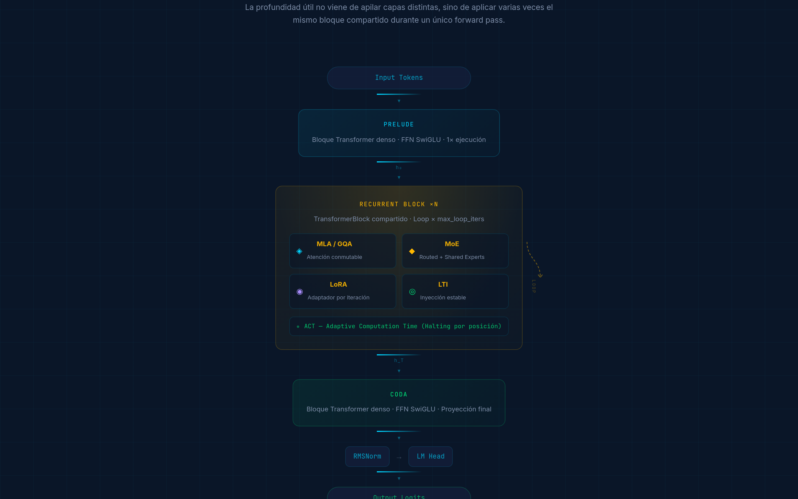
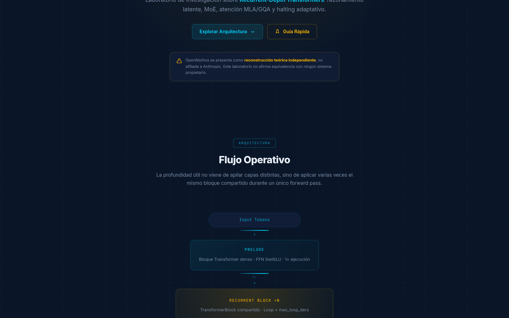
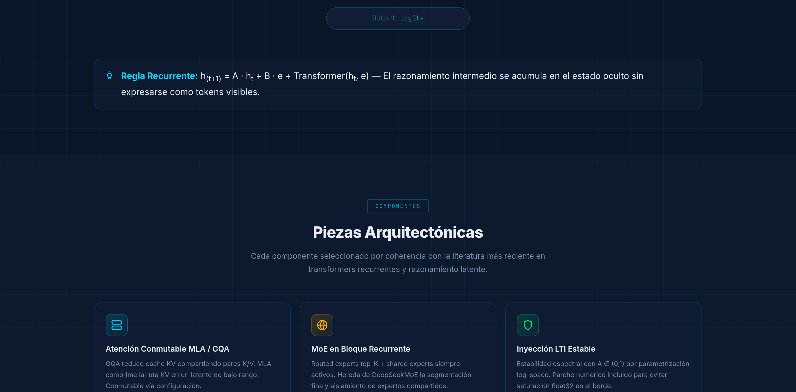
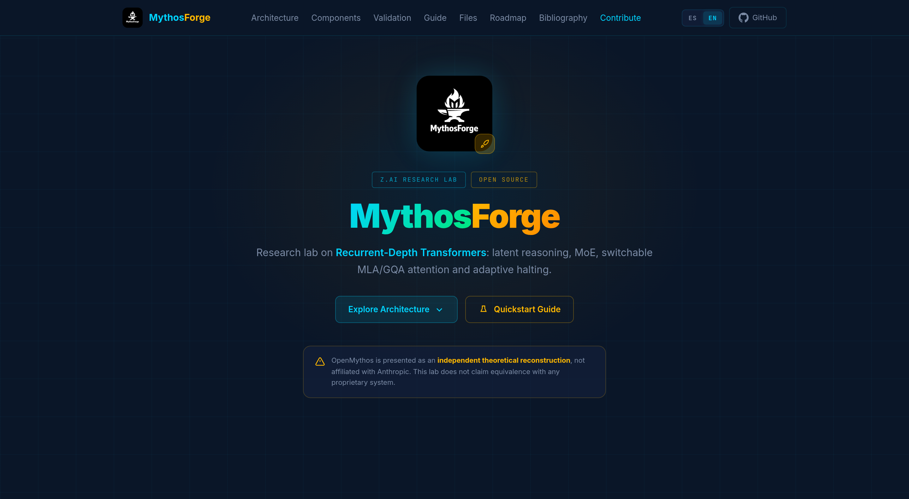

<div align="center">


# 🔥 MythosForge

**Recurrent-Depth Transformer Research Lab**

[](https://smouj.github.io/MythosForge/)
[](LICENSE)
[](https://python.org)
[](https://pytorch.org)
[](.github/workflows/pages.yml)
[](https://smouj.github.io/MythosForge/)
[](SECURITY.md)
[](api/README.md)

*Laboratorio de investigación sobre transformers recurrentes en profundidad, razonamiento latente, MoE, atención MLA/GQA, inyección LTI estable y halting adaptativo.*

[🌐 Demo en Vivo](https://smouj.github.io/MythosForge/) · [📖 Guía Técnica](src/OpenMythos_Guia_Tecnica_2026.pdf) · [🐍 Quickstart](src/openmythos_quickstart.py) · [🔧 Parche LTI](src/openmythos_lti_patch.diff)

---

> ⚠️ **Aviso clave**: OpenMythos se presenta explícitamente como una *reconstrucción teórica independiente*, no afiliada a Anthropic. MythosForge es un laboratorio de experimentación arquitectónica, no una réplica confirmada de Claude Mythos.

</div>

---

## 📸 Capturas de Pantalla

<div align="center">

<details open>
<summary><strong>Español (ES)</strong></summary>

#### Hero & Navegación


#### Diagrama de Arquitectura


#### Componentes Arquitectónicos


#### Validación Práctica


#### Guía Rápida


#### Archivos Descargables


#### Hoja de Ruta


#### Bibliografía


</details>

<details>
<summary><strong>English (EN)</strong></summary>

#### Hero Section (EN)


</details>

</div>

---

## 🧠 ¿Qué es MythosForge?

**MythosForge** es un laboratorio de investigación abierto que documenta, valida y extiende el repositorio público [OpenMythos](https://github.com/kyegomez/OpenMythos) como base seria de experimentación en arquitecturas de transformers recurrentes.

La hipótesis central que investigamos: **la profundidad útil no tiene por qué venir de apilar capas distintas**. Puede venir de aplicar varias veces el mismo bloque compartido durante un único forward, reinyectando la representación codificada del input.

### ¿Qué Sí Hacemos?

| Capacidad | Estado |
|---|---|
| Replicar el repositorio y ejecutarlo | ✅ Validado |
| Documentar la arquitectura completa | ✅ Completado |
| Inferencia mínima con GQA y MLA | ✅ Verificado |
| Proporcionar parche de estabilidad LTI | ✅ Disponible |
| Servir como base de investigación seria | ✅ Activo |

### ¿Qué NO Afirmamos?

| Aserción | Realidad |
|---|---|
| Es una réplica de Claude Mythos | ❌ Es una reconstrucción teórica independiente |
| Tiene pesos preentrenados | ❌ No publica checkpoints |
| Equivalencia con Anthropic | ❌ No afiliada ni demostrada |

---

## 🏗️ Arquitectura — Prelude → Recurrent Block → Coda

```
Input Tokens
     │
     ▼
┌─────────────┐
│   PRELUDE   │  Bloque Transformer denso · FFN SwiGLU · 1× ejecución
└──────┬──────┘
       │ h₀
       ▼
┌─────────────────────────────────────────────┐
│           RECURRENT BLOCK (×N loops)         │
│  ┌───────────────────────────────────────┐  │
│  │  Switchable Attention (MLA / GQA)     │  │
│  │  MoE FFN (Routed + Shared Experts)    │  │
│  │  LoRA Adapter (per-iteration)         │  │
│  │  LTI Injection (stable A ∈ (0,1))     │  │
│  │  ACT Halting (per-position stopping)  │  │
│  └───────────────────────────────────────┘  │
│                    │ ↺ LOOP                  │
└────────────────────┼────────────────────────┘
                     │ h_T
                     ▼
┌─────────────┐
│    CODA     │  Bloque Transformer denso · FFN SwiGLU · 1× ejecución
└──────┬──────┘
       │
       ▼
  RMSNorm → LM Head → Output Logits
```

### Regla Recurrente

El razonamiento intermedio se acumula en el estado oculto `h_t`:

```
h_(t+1) = A · h_t + B · e + Transformer(h_t, e)
```

Donde `A ∈ (0,1)` garantiza estabilidad espectral por construcción paramétrica.

---

## ⚙️ Componentes Técnicos

<details>
<summary><strong>🔮 Atención Conmutable MLA / GQA</strong></summary>

- **GQA**: Reduce la caché KV compartiendo pares K/V entre grupos de cabezas de consulta. Menor overhead, más rápido.
- **MLA**: Comprime la ruta KV en un latente de bajo rango y reconstruye K/V al vuelo. Más ambicioso y con mayor compresión de memoria.
- Conmutable mediante configuración: `attn_type="gqa"` o `attn_type="mla"`.

**Referencias**: [DeepSeek-V2 (MLA)](https://arxiv.org/abs/2405.04434), [GQA](https://arxiv.org/abs/2305.13245)
</details>

<details>
<summary><strong>🧩 Mixture of Experts (MoE)</strong></summary>

- Routed experts top-K + shared experts siempre activos.
- Hereda de [DeepSeekMoE](https://arxiv.org/abs/2401.06066) la segmentación fina y el aislamiento de expertos compartidos.
- Maximiza la relación rendimiento/cómputo dentro del bloque recurrente.
</details>

<details>
<summary><strong>🛡️ Inyección LTI Estable</strong></summary>

- Linear Time-Invariance injection con parametrización log-space.
- Garantiza `A ∈ (0,1)` por construcción, manteniendo estabilidad espectral.
- **Parche numérico incluido**: evita saturación float32 en el borde de 1.0.

```python
def get_A(self) -> torch.Tensor:
    A = torch.exp(-torch.exp((self.log_dt + self.log_A).clamp(-20, 20)))
    return torch.minimum(
        A,
        torch.nextafter(torch.ones_like(A), torch.zeros_like(A)),
    )
```

**Referencia**: [Parcae](https://arxiv.org/abs/2604.12946)
</details>

<details>
<summary><strong>⚡ ACT — Adaptive Computation Time</strong></summary>

- Aprende una probabilidad de halting por posición de secuencia.
- Permite que algunas posiciones dejen de acumular actualizaciones antes que otras.
- Optimiza el cómputo de inferencia de forma adaptativa.

**Referencia**: [ACT (Graves, 2016)](https://arxiv.org/abs/1603.08983)
</details>

<details>
<summary><strong>🔄 Adaptador LoRA por Iteración</strong></summary>

- Cada iteración del bucle puede modificar su comportamiento con un adaptador LoRA dependiente de la iteración.
- Enriquece la representación sin multiplicar parámetros estáticos.
- Señal de profundidad mediante embedding sinusoidal de índice de loop.
</details>

---

## ✅ Validación Práctica

Ejecutado localmente en CPU con **PyTorch 2.10.0+cpu** y configuraciones pequeñas.

| Chequeo | Resultado |
|---|---|
| Import y construcción del modelo | ✅ Correcto |
| Forward mínimo con GQA | ✅ Correcto |
| Forward mínimo con MLA | ✅ Correcto |
| Generación mínima autoregresiva | ✅ Correcta |
| Matriz A de LTI en rango estable | ✅ Correcto |
| `test_spectral_radius_stable_after_large_grad_step` | ⚠️ Fallo numérico (parcheado) |

### Hallazgo Importante

La prueba `test_spectral_radius_stable_after_large_grad_step` falla porque `A.max()` puede redondear a `1.0` en float32 tras un paso de SGD extremo. El parche incluido ([`openmythos_lti_patch.diff`](src/openmythos_lti_patch.diff)) resuelve esto sin alterar la arquitectura.

---

## 🚀 Guía Rápida

### 1. Preparación del entorno

```bash
git clone https://github.com/kyegomez/OpenMythos.git
cd OpenMythos
python -m venv .venv
source .venv/bin/activate
python -m pip install -U pip
pip install -r requirements.txt
```

### 2. Arranque rápido

```bash
python example.py
# o con verificación compacta:
python openmythos_quickstart.py
```

### 3. Validación

```bash
pytest -q
# Para excluir el fallo numérico conocido:
pytest -q -k "not test_spectral_radius_stable_after_large_grad_step"
```

### 4. Aplicar parche de estabilidad LTI

```bash
git apply openmythos_lti_patch.diff
```

---

## 🌐 API REST

MythosForge incluye una **API REST real** construida con FastAPI. Sirve todos los datos del proyecto como JSON estructurado con schemas Pydantic, e incluye un endpoint de inferencia con el modelo OpenMythos.

### Arranque rápido

```bash
pip install -r api/requirements.txt
python -m api
# → http://localhost:8000/docs (Swagger UI)
```

### Endpoints principales

| Método | Endpoint | Descripción |
|--------|----------|-------------|
| `GET` | `/api/v1/health` | Estado del servicio y dependencias |
| `GET` | `/api/v1/info` | Información del proyecto |
| `GET` | `/api/v1/architecture` | Arquitectura completa |
| `GET` | `/api/v1/components` | Componentes arquitectónicos |
| `GET` | `/api/v1/components/{slug}` | Componente específico |
| `GET` | `/api/v1/validation` | Resultados de validación |
| `GET` | `/api/v1/roadmap` | Hoja de ruta |
| `GET` | `/api/v1/references` | Referencias académicas |
| `GET` | `/api/v1/i18n/{lang}` | Traducciones (es/en) |
| `POST` | `/api/v1/inference` | Inferencia con OpenMythos |

### Inferencia real

```bash
# Instalar PyTorch + OpenMythos
pip install torch --index-url https://download.pytorch.org/whl/cpu
git clone https://github.com/kyegomez/OpenMythos.git && cd OpenMythos && pip install -e .

# Ejecutar inferencia
curl -X POST http://localhost:8000/api/v1/inference \
  -H "Content-Type: application/json" \
  -d '{"prompt": "Test", "attn_type": "gqa", "n_loops": 4}'
```

### Docker

```bash
# Modo datos (ligero)
docker build -f api/Dockerfile -t mythosforge-api .
docker run -p 8000:8000 mythosforge-api

# Modo completo con inferencia
docker build -f api/Dockerfile.full -t mythosforge-api-full .
docker run -p 8000:8000 mythosforge-api-full
```

---

## 📂 Estructura del Repositorio

```
MythosForge/
├── api/
│   ├── __init__.py              # Paquete API (v0.2.0)
│   ├── __main__.py              # python -m api (arranque directo)
│   ├── app.py                   # FastAPI app — todos los endpoints
│   ├── models.py                # Schemas Pydantic v2
│   ├── data.py                  # Datos reales del proyecto
│   ├── routers/
│   │   └── inference.py         # Endpoint de inferencia OpenMythos
│   ├── requirements.txt          # Dependencias API
│   ├── Dockerfile               # Docker (modo datos)
│   ├── Dockerfile.full          # Docker (inferencia completa)
│   └── README.md                # Documentación API
├── docs/
│   ├── index.html              # GitHub Pages — Landing estática (i18n ES/EN)
│   ├── i18n.js                  # Motor de traducciones ES/EN (~170 claves)
│   ├── assets/
│   │   └── style.css           # Estilos profesionales (dark theme)
│   └── images/
│       ├── logo.png            # Logo del proyecto
│       ├── logo_readme.png     # Logo oficial (fondo negro + icono blanco)
│       ├── favicon.png         # Favicon
│       ├── social_banner.png   # Banner social (OG/Twitter card, 1200x630)
│       └── 01-hero.png         # Screenshots por sección (element-based)
│       ├── 02-architecture.png
│       ├── 03-components.png
│       ├── 04-validation.png
│       ├── 05-guide.png
│       ├── 06-files.png
│       ├── 07-roadmap.png
│       ├── 08-bibliography.png
│       └── 09-hero-en.png
├── src/
│   ├── OpenMythos_Guia_Tecnica_2026.pdf   # Guía técnica completa
│   ├── OpenMythos_Guia_Tecnica_2026.docx  # Versión editable
│   ├── openmythos_quickstart.py           # Script de verificación mínima
│   └── openmythos_lti_patch.diff          # Parche de estabilidad LTI
├── .github/
│   ├── CODEOWNERS              # Responsables de revisión por área
│   ├── FUNDING.yml             # GitHub Sponsors
│   ├── SECURITY.md             # Política de seguridad
│   ├── dependabot.yml          # Actualización automática de dependencias
│   ├── workflows/
│   │   └── pages.yml           # CI/CD: deploy automático a GitHub Pages
│   ├── ISSUE_TEMPLATE/
│   │   ├── bug_report.md
│   │   ├── feature_request.md
│   │   └── experiment.md
│   └── PULL_REQUEST_TEMPLATE/
│       └── pull_request_template.md
├── CONTRIBUTING.md             # Guía de contribuciones
├── SECURITY.md                 # Política de seguridad
├── LICENSE                     # Licencia MIT
├── README.md                   # Este archivo
└── .gitignore                  # Git ignore rules
```

---

## 🗺️ Hoja de Ruta

| Fase | Objetivo | Estado |
|---|---|---|
| 0 | Congelar versión (fork, tag, requirements-lock) | ✅ |
| 1 | Corregir estabilidad operativa (parche LTI) | ✅ |
| 2 | Añadir empaquetado (pyproject.toml, CLI) | 🔲 |
| 3 | Tokenizer y datos (tokenizer, dataset, causal LM) | 🔲 |
| 4 | Entrenamiento mínimo (train.py, warmup, checkpoints) | 🔲 |
| 5 | Benchmarks (curvas vs loops, GQA vs MLA, ablations) | 🔲 |
| 6 | Publicación y comparativa (vs transformers densos) | 🔲 |

---

## 🎯 Preguntas de Investigación

1. **¿Cuánto razonamiento extra aporta el looping en inferencia?** — Medir ganancia al aumentar `n_loops`, comparar contra transformer denso de igual presupuesto.

2. **¿Cuándo MLA merece la complejidad frente a GQA?** — Latencia, memoria y calidad para determinar el punto de inflexión.

3. **¿Si MoE dentro de un bloque recurrente mejora rendimiento/cómputo?** — Distribución de expertos por loop, especialización efectiva, comparación vs FFN denso.

---

## 📚 Bibliografía

| ID | Referencia | Enlace |
|---|---|---|
| R1 | OpenMythos README | [GitHub](https://github.com/kyegomez/OpenMythos) |
| R2 | OpenMythos docs | [GitHub](https://github.com/kyegomez/OpenMythos/blob/main/docs/open_mythos.md) |
| R3 | Thread — Kye Gomez | [ThreadReader](https://threadreaderapp.com/user/KyeGomezB) |
| R4 | Loop, Think, & Generalize | [arXiv:2604.07822](https://arxiv.org/abs/2604.07822) |
| R5 | Parcae: Scaling Laws for Looped LMs | [arXiv:2604.12946](https://arxiv.org/abs/2604.12946) |
| R6 | Reasoning with Latent Thoughts | [arXiv:2502.17416](https://arxiv.org/abs/2502.17416) |
| R7 | Coconut: Continuous Latent Reasoning | [arXiv:2412.06769](https://arxiv.org/abs/2412.06769) |
| R8 | DeepSeek-V2 (MLA) | [arXiv:2405.04434](https://arxiv.org/abs/2405.04434) |
| R9 | GQA | [arXiv:2305.13245](https://arxiv.org/abs/2305.13245) |
| R10 | DeepSeekMoE | [arXiv:2401.06066](https://arxiv.org/abs/2401.06066) |
| R11 | Universal Transformers | [arXiv:1807.03819](https://arxiv.org/abs/1807.03819) |
| R12 | Adaptive Computation Time | [arXiv:1603.08983](https://arxiv.org/abs/1603.08983) |

---

## 🤝 Contribuciones

Este proyecto es un laboratorio de investigación abierto. Las contribuciones son bienvenidas en forma de:

- 🧪 Experimentos y benchmarks reproducibles
- 📝 Documentación y análisis técnico
- 🐛 Patches de estabilidad y optimización
- 📊 Visualizaciones y herramientas de diagnóstico

Por favor, abre un [Issue](https://github.com/smouj/MythosForge/issues) para discutir cualquier propuesta antes de enviar un PR.

---

## ⚖️ Licencia

Este proyecto se distribuye bajo la licencia **MIT**. Ver [LICENSE](LICENSE) para más detalles.

El repositorio original OpenMythos también se distribuye bajo licencia MIT.

---

<div align="center">

**Creado por [Smouj013](https://github.com/smouj) con agentes de IA**

*Documento técnico independiente — Abril 2026*

</div>
